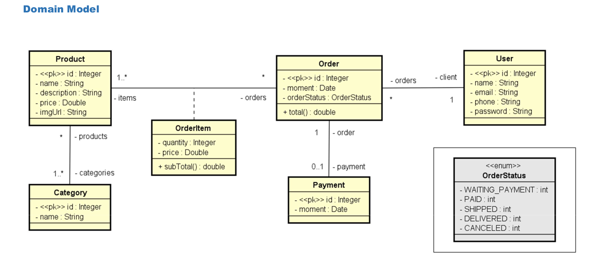

# 🛒 Webserver API - Sistema de Pedidos com Spring Boot

Este projeto é uma API RESTful desenvolvida com **Spring Boot**, que simula um sistema completo de pedidos, usuários, produtos, categorias e pagamentos. Ideal para quem quer estudar e praticar conceitos sólidos de modelagem de domínio, JPA, relacionamento entre entidades e boas práticas em APIs REST.

---

## 📚 Visão Geral

A API permite o gerenciamento de:

- **Usuários** (clientes)
- **Produtos**
- **Categorias de produtos**
- **Pedidos**
- **Itens dos pedidos**
- **Pagamentos**

Foi desenvolvido com base em uma estrutura de domínio bem definida, onde os relacionamentos entre as entidades refletem um cenário real de marketplace ou e-commerce.

---

## 🔧 Tecnologias Utilizadas

- Java 21
- Spring Boot 3.4.x
- Spring Data JPA
- Spring Web
- H2 Database (ambiente de testes)
- PostgreSQL (produção/dev)
- Maven
- JPA/Hibernate

---

## 📦 Modelo de Domínio




## 🚀 Funcionalidades da API

- Autenticação
- Sistema de roles e papeis - ADMIN e USER
- Criar e listar usuários
- Cadastrar produtos e associar a múltiplas categorias
- Criar pedidos com itens e calcular totais
- Atualizar status do pedido
- Simular pagamento de pedidos

---

## 📄 Como Rodar o Projeto

### ✅ Pré-requisitos

- Java 21+
- Maven
- PostgreSQL ou usar banco em memória (H2)

### 🚀 Executando

```bash
# setando o profile ativo (dev, test, prod)
export APP_PROFILE=dev

# rodando com maven
mvn spring-boot:run
